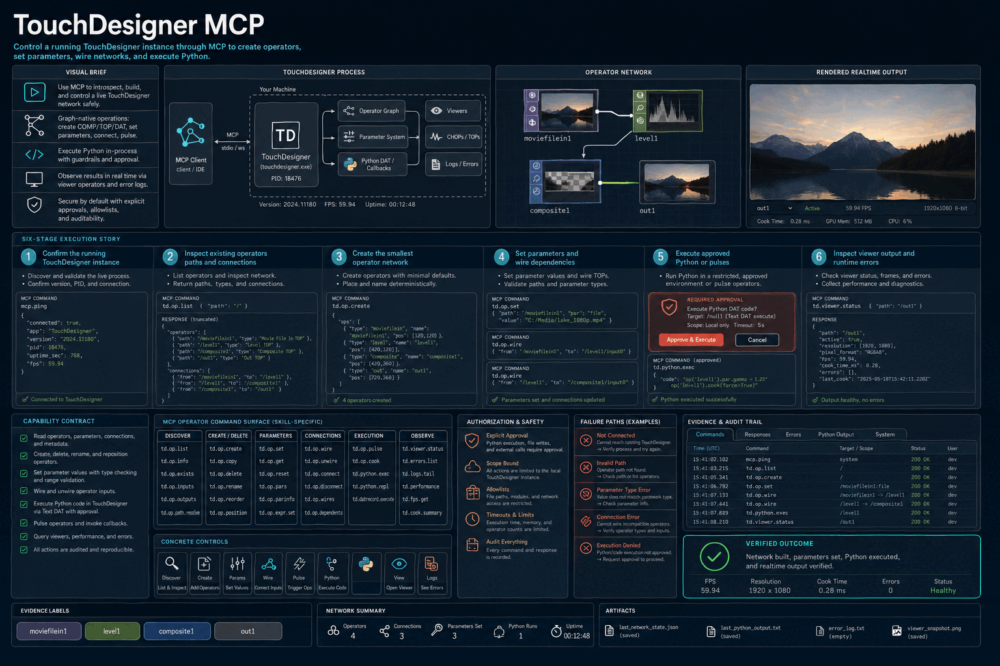

# How TouchDesigner MCP Works

Control a running TouchDesigner instance through MCP to create operators, set parameters, wire networks, and execute Python.

## Stages

### 1. Confirm the running TouchDesigner instance

**Primary surface:** `Visual brief`

Record the input, operation, observable output, and any decision that changes scope. Stop here if the output is missing, contradictory, or insufficient for the next stage.
### 2. Inspect existing operators paths and connections

**Primary surface:** `TouchDesigner process`

Record the input, operation, observable output, and any decision that changes scope. Stop here if the output is missing, contradictory, or insufficient for the next stage.
### 3. Create the smallest operator network

**Primary surface:** `Operator network`

Record the input, operation, observable output, and any decision that changes scope. Stop here if the output is missing, contradictory, or insufficient for the next stage.
### 4. Set parameters and wire dependencies

**Primary surface:** `MCP parameter commands`

Record the input, operation, observable output, and any decision that changes scope. Stop here if the output is missing, contradictory, or insufficient for the next stage.
### 5. Execute approved Python or pulses

**Primary surface:** `Rendered realtime output`

Record the input, operation, observable output, and any decision that changes scope. Stop here if the output is missing, contradictory, or insufficient for the next stage.
### 6. Inspect viewer output and runtime errors

**Primary surface:** `Rendered realtime output`

Record the input, operation, observable output, and any decision that changes scope. Stop here if the output is missing, contradictory, or insufficient for the next stage.

## Failure handling

- **Authorization failure:** do not probe credentials or broaden access; report the missing authority.
- **Target ambiguity:** stop before mutation and request the minimum identifying information.
- **Tool or service failure:** retain error evidence, retry only safe transient failures, and cap retries.
- **Verification failure:** classify the run as incomplete even when the preceding operation returned success.

## Completion evidence

The handoff should contain the original request, inspection state, preview or plan, exact execution result, direct verification, and a final receipt naming limitations and withheld actions.
